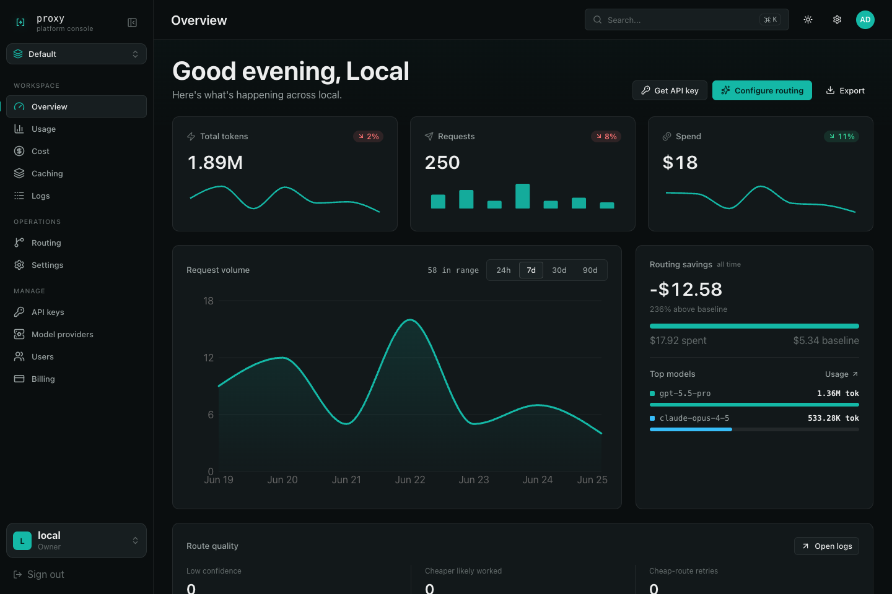
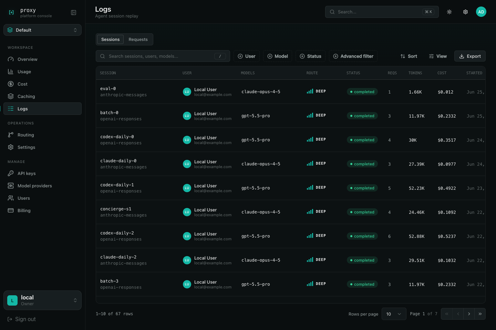

# Proxy User Guide

This guide is the operator-facing path through Proxy: get it running, connect a coding agent, route traffic through provider credentials, and use the console to understand what happened.

Use this alongside the root [README](../../README.md). The README is the project overview; this folder is the end-to-end product manual.

## What Proxy Does

Proxy sits between coding agents and model providers. Clients keep speaking OpenAI or Anthropic-compatible APIs, while Proxy handles:

- API-key authentication and user/workspace attribution.
- Routing to the right provider/model tier.
- Provider credential selection, including BYOK and subscription credentials.
- Sessions, request logs, prompt artifacts, provider attempts, usage, cost, and compression receipts.
- Operator dashboards for monitoring, analytics, routing configs, settings, and provider health.

## Console Screenshots

The overview dashboard is the first stop for traffic, token volume, spend, and routing savings.

The logs view is where operators inspect a request, session, selected model, route, token usage, and cost.

## Read This In Order

1. [Quickstart](quickstart.md): run Proxy locally, log into the console, and send a test request.
2. [API Keys And Harness Setup](api-keys.md): create Proxy API keys and connect Codex, Claude Code, opencode, Cursor, or SDK callers.
3. [Provider Auth](provider-auth.md): connect provider API keys, BYOK credentials, and subscription credentials.
4. [Monitoring](monitoring.md): use the overview, logs, metrics, and provider health signals.
5. [Sessions And Request Replay](sessions.md): debug agent sessions and inspect prompt/request evidence.
6. [Analytics And Spend](analytics.md): understand usage, cost, savings, pricing, and token attribution.
7. [Token Compression](token-compression.md): enable, preview, and monitor deterministic tool-result compression.

## Mental Model

Each request follows the same shape:

1. A client sends traffic to Proxy with a Proxy API key.
2. Proxy resolves the organization, workspace, user, and routing config.
3. The request is classified or pinned to a model tier.
4. The selected provider target resolves an upstream credential.
5. Proxy forwards the request and records events, attempts, usage, cost, artifacts, and compression receipts.
6. The console projects those records into dashboards, logs, sessions, and analytics.

## Common Operator Tasks

| Task | Start here |
| --- | --- |
| Run Proxy locally | [Quickstart](quickstart.md) |
| Create a key for a teammate or harness | [API Keys And Harness Setup](api-keys.md) |
| Add OpenAI or Anthropic credentials | [Provider Auth](provider-auth.md) |
| Bind BYOK credentials to a key | [Provider Auth](provider-auth.md#bind-provider-credentials-to-api-keys) |
| See whether traffic is healthy | [Monitoring](monitoring.md) |
| Debug a single agent session | [Sessions And Request Replay](sessions.md) |
| Explain spend or token volume | [Analytics And Spend](analytics.md) |
| Reduce repeated tool-result token cost | [Token Compression](token-compression.md) |

## Related Reference

- [Harness compatibility matrix](../harnesses/compatibility-matrix.md)
- [opencode setup](../harnesses/opencode.md)
- [Cursor BYOK setup](../harnesses/cursor-byok.md)
- [Claude Code setup](../harnesses/claude-code.md)
- [Routing configs runbook](../runbooks/routing-configs.md)
- [Proxy metrics runbook](../runbooks/proxy-metrics.md)
- [Subscription auth runbook](../runbooks/subscription-auth.md)
